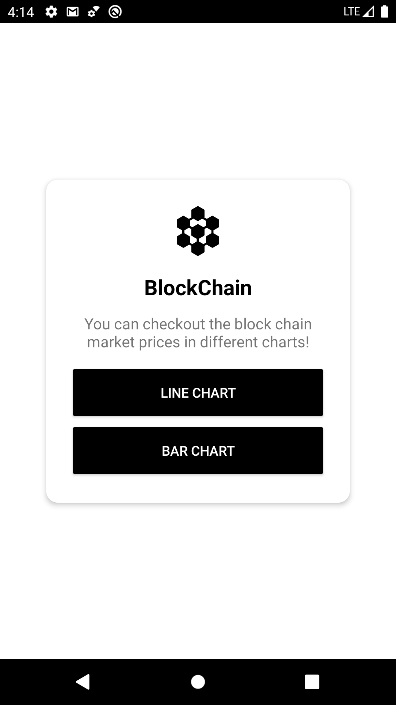
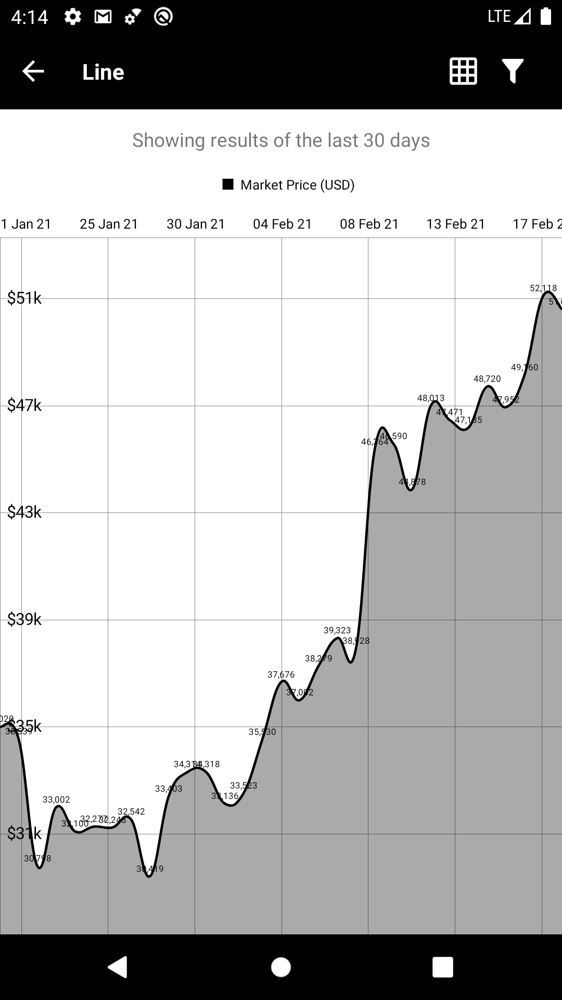
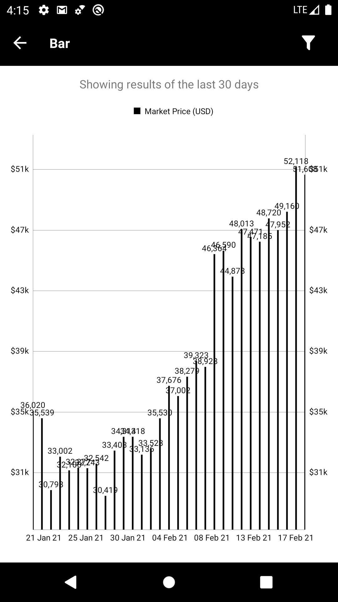

# BlockChain

A simple project that checks the current market price of BlockChain and displays it on a graph.
At the moment there are only two available charts, a line and bar charts.

#### The project was develop using
> Kotlin; MVVM; RxJava; Retrofit; Coroutines; Dagger, MPAndroidChart;

#### The project has unit tests and tests
> jUnit; MockK; Espresso;

The project has some improvements to do, so it's not finished yet.

# Current screens:

 
 
